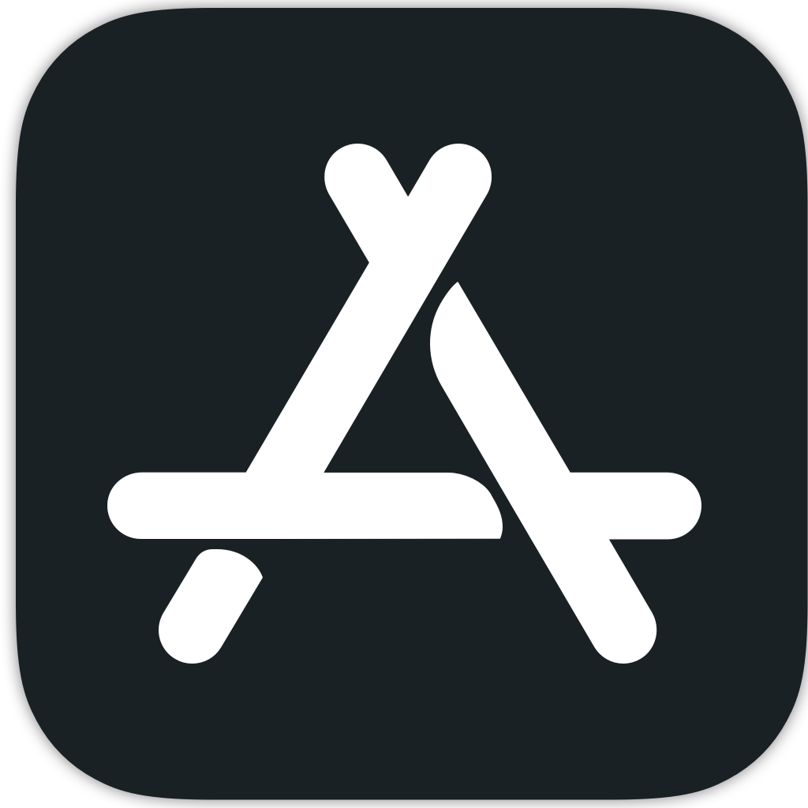
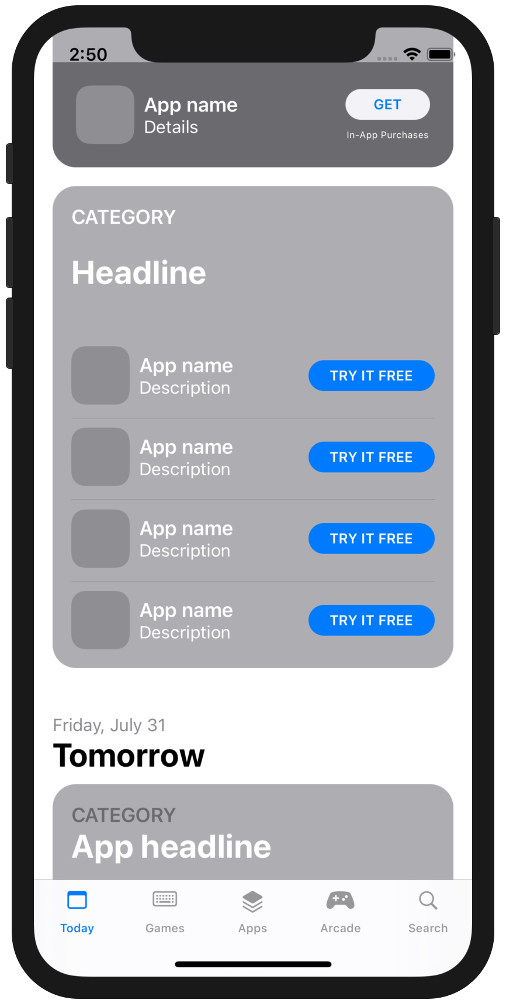
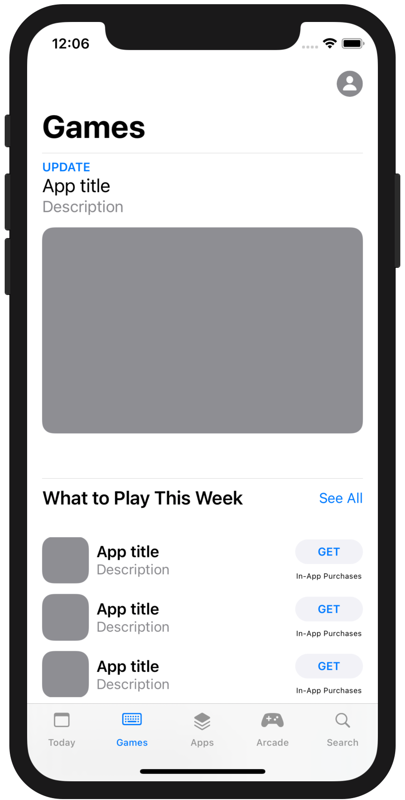
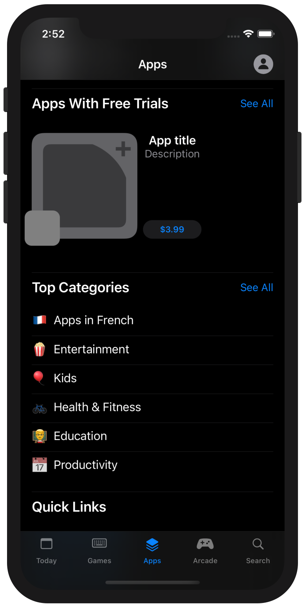
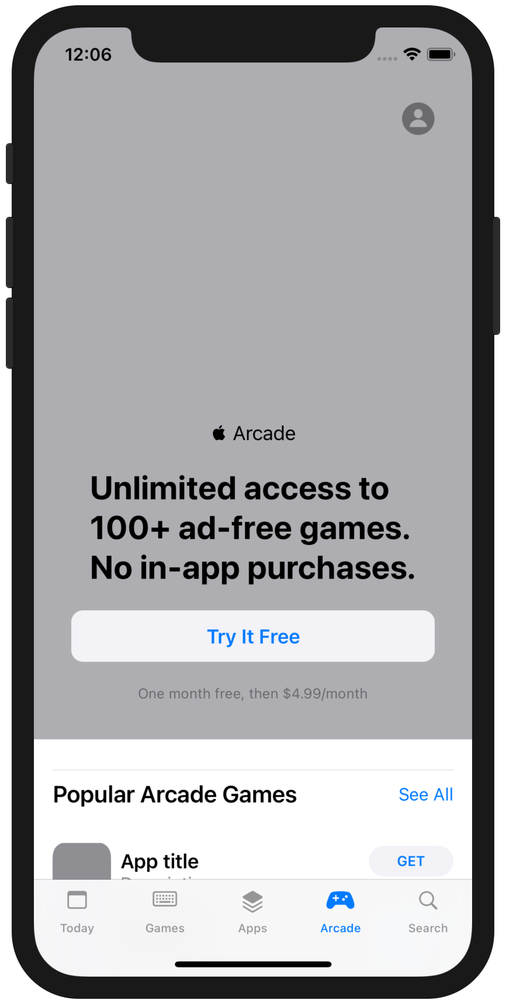
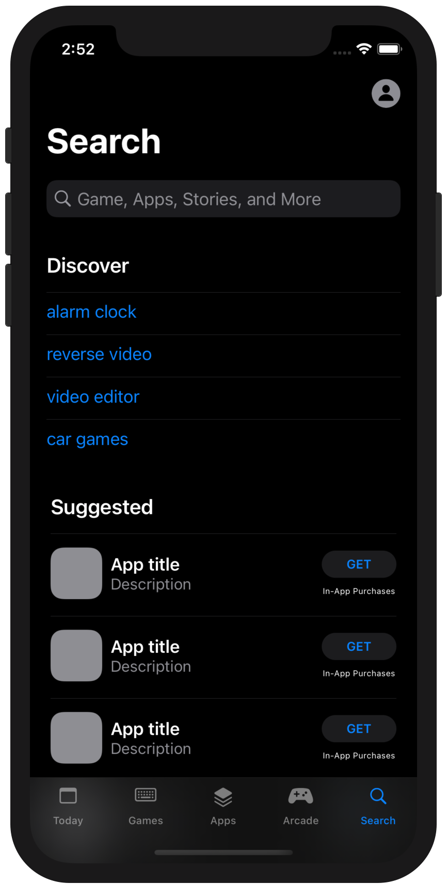

<!-- HEADER -->

<h1>AppStore Replica App</h1>

[][Swift]
[][iOS]
[][Twitter]

<!-- BODY -->
## Documentation
- [SwiftUI framework](https://developer.apple.com/documentation/swiftui)

## Frameworks/External dependencies
- Foundation
- SwiftUI

## Description
AppStore Replica pretends to be a **copy of the App Store layout made entirely in SwiftUI**. In order to structure the project, views have been divided into **three groups: Screens, Blocks and Elements**. **Screens** are made up of the **sum of views that generate a complete screen in the app**, while **Blocks** are basically **partial views that are used multiple times** during the project. Finally, **basic views** like buttons, labels or lists belong to the **Elements** group.

The **goal** of this project is to **put into practice the concepts learned in SwiftUI** and understand better how views are divided, reused and connected in a multi-tab-application.

## Preview
Those are the most relevant screenshots of the app.

	
	
	
	
	
	

<!-- FOOTER -->
<!-- Permanent links -->
[Swift]: https://www.swift.org
[iOS]: https://developer.apple.com/ios/
[Twitter]: https://twitter.com/TomEstelrich